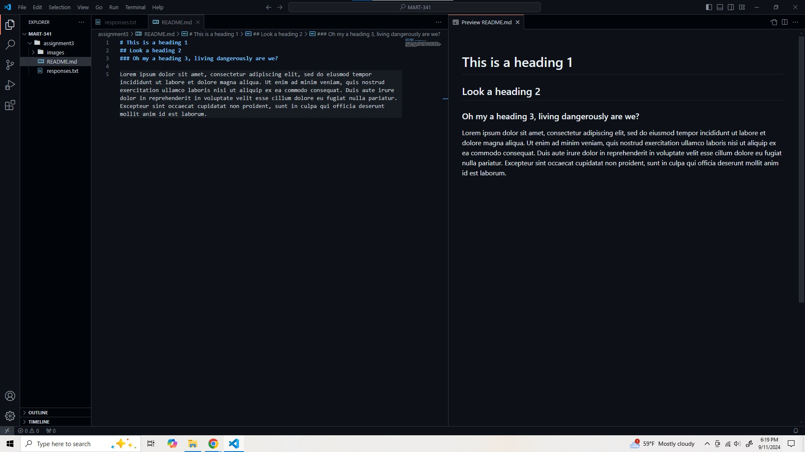

# This is a heading 1.
## This is a subheading using heading 2.

Markdown was a lot of fun to learn, it gave me a better understanding some of the basics. 

**Problems**
Something that I struggled with a little bit was linking images. I kept forgetting the the (.) before the path (/) and spent a little longer than necessary chasing issuues. 

- *Solutions* I have to be a lot more careful when writing code so that I am not missing little things that cause big problems.
   - Check code to see if the line is colored, if not check the code.
   - If the code works, but not the way you intended, retype it or try to do it another way.
 
Here is a image!

[Here is a link to that same image!](./images/screenshot.jpg)

